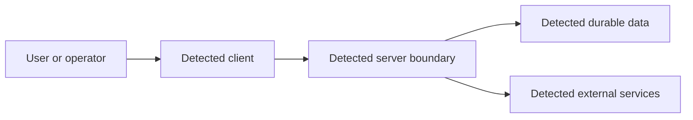

# Architecture map

Replace each placeholder only with a discovery supported by file, line, and confidence evidence.
Annotate public/private/admin routes, identity, tenant, uploads, jobs, payments, AI tools, and other
trust boundaries. Record unknown runtime-only components rather than guessing them.
