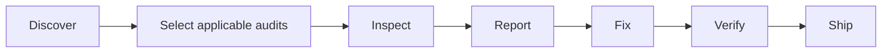

<div align="center">
  

# Fullstack Forge

**Build and verify production-ready applications through one simple AI-agent workflow.**

One product entrance. Forty-two audit specialists. Evidence before confidence.

[](https://github.com/thethunderbolt/fullstack-forge-skill/releases)
[](https://github.com/thethunderbolt/fullstack-forge-skill/actions/workflows/ci.yml)
[](LICENSE)
[](SECURITY.md)
[](package.json)
</div>

Fullstack Forge helps AI coding agents build and verify production-ready applications without
treating missing evidence as success. It discovers the actual stack, selects applicable checks,
gathers reproducible evidence, separates safe fixes from risky decisions, and gives first-time users
one plain-language entrance while preserving the complete expert workflow.

Evidence-driven Build and Audit workflows for production full-stack applications and AI coding
agents remain one product: `Forge` is the beginner entrance, while `Fullstack Forge — Expert Audit`
preserves the advanced audit orchestrator.

It works as an open-format Agent Skill collection and as a dependency-light TypeScript CLI.

```text
You:    /forge audit the login system
Forge:  Audit finished — evidence is incomplete.
        Confirmed: 1 failed, 0 warnings
        Evidence gaps: 2 blocked, 3 not verified
        Safe fix: not automatic; review or approval is required
        Details: .forge/report.md and .forge/report.json
```

## Install and start

Node.js 24 or newer and Git are required. The reliable full-product route is:

```bash
npm install --save-dev github:thethunderbolt/fullstack-forge-skill#v0.5.1
npx forge init
npx forge doctor
```

Then build or inspect in ordinary language:

```bash
npx forge build "add customer login"
npx forge audit
npx forge status
```

Use `/forge ...` on hosts that expose skill names as slash commands. In Codex:

1. Open the skill picker.
2. Select **Forge**.
3. Choose an action from the displayed menu or describe the task normally.

The picker preview is **Build · Audit · Fix · Verify · Ship · Status**. The default prompt also
routes Continue and Help and shows the ten-choice beginner menu when no action is supplied. Codex
does not expose each action as a separate native slash command: the single Forge skill is the
visible product entrance and routes to the existing workflows. Running `npx forge` opens the same
guided action set in an interactive terminal and prints a script-friendly numbered list otherwise.

The one-command skills-only alternative is documented in [Getting started](docs/GETTING_STARTED.md).
It uses the current third-party skills installer with `--copy`; use the full-product route above for
the persistent CLI, doctor, and ownership-aware updates. Supported agents include Codex, Claude
Code, Cursor, Gemini CLI, Antigravity, Windsurf, GitHub Copilot, and generic Agent Skills hosts.

[Build your first feature](docs/BUILD_YOUR_FIRST_FEATURE.md) ·
[Audit your application](docs/AUDIT_YOUR_APPLICATION.md) · [Fix and verify](docs/FIX_AND_VERIFY.md)
· [Ship](docs/SHIP_A_RELEASE.md) · [Nontechnical guide](docs/NONTECHNICAL_GUIDE.md) ·
[Troubleshooting](docs/TROUBLESHOOTING.md) · [Advanced CLI](docs/ADVANCED_CLI.md)

## Two modes

**Build mode** — use while starting a project or implementing a feature, so the agent follows a
production-quality engineering workflow. **Audit mode** — use to inspect, harden, and gate work that
already exists, including work built in Build mode.

| You want to...                      | Mode  | Entry point                                  |
| ----------------------------------- | ----- | -------------------------------------------- |
| Start a new product or codebase     | Build | `/forge build` (`forge build`)               |
| Build or continue one feature       | Build | `/forge build <request>` / `/forge continue` |
| Inspect or harden existing behavior | Audit | `/forge audit [all \| area]`                 |
| Gate a release                      | Audit | `/forge ship` (`forge ship`)                 |

A coherent project journey: `forge new` frames the product once; each feature then runs
`forge feature <slug>` through frame → plan → implement → check → done; before release, the
independent backstop runs regardless of how the code was built — `forge all audit` (or
`--scope changed` for a diff) → `forge all fix --safe` → `forge all verify` → `forge ship`. Build
mode's `frame` and `plan` are recorded guidance. `check` and `done` re-derive applicability and a
tier-specific gate plan, then accept positive results only from registered producers whose typed
evidence is current for the selected root, revision, inputs, and artifacts. Build evidence under
`.forge/build/` satisfies zero `forge ship` or `forge all audit` gates; Ship performs a fresh,
stable-revision inspection and treats prior reports as diagnostics only. See
[docs/BUILD_MODE.md](docs/BUILD_MODE.md) for the complete guide.

Expert `/forge-new`, `/forge-feature`, `/forge-<section>`, and `/fullstack-forge` entries remain
available and unchanged. In Codex, the latter appears as **Fullstack Forge — Expert Audit**.

Codex, Claude Code, Antigravity, Gemini CLI, Cursor, Windsurf, GitHub Copilot, and generic Agent
Skills are supported. [Commands](docs/COMMANDS.md) · [Platforms](docs/PLATFORM_SUPPORT.md) ·
[Contributing](CONTRIBUTING.md) · [Security](SECURITY.md) ·
[Releases](https://github.com/thethunderbolt/fullstack-forge-skill/releases)

## Why this exists

“Check best practices” is not an audit. Production readiness crosses product logic, interface
states, identity, authorization, data integrity, hostile inputs, failure recovery, deployment,
operations, and specialized features such as payments or AI tools. Fullstack Forge turns those
concerns into concrete procedures with stable findings and an honest completion contract.



## Install

### From a release archive

Download the archive for your agent from the
[latest release](https://github.com/thethunderbolt/fullstack-forge-skill/releases), verify it
against `SHA256SUMS.txt`, and extract it at the project root. Archives contain real copies, never
symlinks.

### With npm, from the Git tag

Fullstack Forge is **not published to the npm registry**. The working npm-based installation
resolves the package directly from its Git tag:

```bash
npm install --save-dev github:thethunderbolt/fullstack-forge-skill#v0.5.1
npx forge init all --dry-run
npx forge init
```

#### After npm registry publication

Registry publication has not happened yet. Once it does — and not before — the command below will
work. It does **not** work today, and this section is retained only to document the intended future
form:

```bash
# NOT YET AVAILABLE — the package is not on the npm registry.
npm install --save-dev fullstack-forge-skill
```

With no selector, the installer keeps the compatible `all` default while detecting finite existing
agent-configuration markers and executable-name hints, then recommends any narrower matching
selector. It never runs a detected executable or treats a hint as proof that a host is active. It
writes `.fullstack-forge/install-manifest.json`, atomically records ownership before new managed
files, resumes safely after interruption, will not overwrite unowned or modified files, follows no
destination symlinks, and uninstalls only unchanged files it owns.

## Quick start

Simple product workflow:

```text
/forge build
/forge build add customer login
/forge continue
/forge audit
/forge fix
/forge verify
/forge ship
/forge status
/forge help
```

```bash
forge build "add customer login"
forge continue
forge audit
forge fix                 # preview only
forge fix --safe          # reviewed bounded edits only
forge verify
forge ship
```

Audit mode, inspecting and gating what already exists:

```text
$fullstack-forge audit this application before release
$forge-security audit the changed authentication flow
/forge-ui audit the running application at mobile and desktop widths
```

```bash
forge discover audit
forge ui audit
forge ux audit
forge security audit --json
forge uploads audit
forge queries audit
forge all audit --scope changed --base origin/main
forge all audit --scope full
forge all fix --safe
forge ship --allow-run
```

Discovery creates ignored local artifacts at `.forge/project-profile.json` and
`.forge/architecture-map.md`. Audits generate `.forge/report.json` and `.forge/report.md`. Build
mode creates `.forge/build/` (`project.json`, `features/<slug>.json`, `DECISIONS.md`, `DESIGN.md`) —
agent context only, never a ship-gate input. See [docs/BUILD_MODE.md](docs/BUILD_MODE.md).

## The 42 skills

| Family        | Skills                                                                                                                                                                                                          |
| ------------- | --------------------------------------------------------------------------------------------------------------------------------------------------------------------------------------------------------------- |
| Foundation    | `forge-discover`, `forge-requirements`, `forge-architecture`, `forge-code`                                                                                                                                      |
| Experience    | `forge-ui`, `forge-ux`, `forge-accessibility`, `forge-i18n`, `forge-seo`, `forge-frontend`                                                                                                                      |
| Boundaries    | `forge-api`, `forge-jobs`, `forge-integrations`, `forge-auth`, `forge-authorization`, `forge-security`, `forge-privacy`, `forge-tenancy`, `forge-uploads`                                                       |
| Data          | `forge-database`, `forge-queries`, `forge-cache`, `forge-storage`                                                                                                                                               |
| Delivery      | `forge-testing`, `forge-performance`, `forge-scale`, `forge-observability`, `forge-reliability`, `forge-recovery`, `forge-deployment`, `forge-infrastructure`, `forge-supply-chain`, `forge-cost`, `forge-docs` |
| Specialized   | `forge-analytics`, `forge-notifications`, `forge-ai`, `forge-payments`, `forge-realtime`, `forge-offline`                                                                                                       |
| Orchestration | `forge-all`, `forge-ship`                                                                                                                                                                                       |

Every command skill is self-contained and supports `audit`, `fix`, `verify`, and `report`. Each one
defines when it applies, inputs, an executable and manual procedure, evidence rules, stable IDs,
severity, safe/risky fixes, verification, standards, stack guidance, limitations, and the same
completion contract. Together they enumerate 957 explicit inspection criteria and 212
discipline-specific inspection steps — `forge-database` reads schema, types, cascades, and migration
history, while `forge-realtime` traces connect authorization, channel isolation, reconnection, and
backpressure — so specialized risks remain visible instead of disappearing behind a generic “best
practices” instruction.

The audit module set stays closed at 42. The bundle also ships the simple `forge` router plus the
expert Build command skills `forge-new` and `forge-feature` — 46 skills in total including the
master `fullstack-forge` skill.

## Finding contract

Every finding includes:

```text
id · instance_id · section · title · severity · confidence · status · location · evidence
impact · recommendation · safe_fix · verification · standards · analyzer_id
trace · evidence_snapshot · verification_plan · fix_attempts
```

Statuses are `PASS`, `FAIL`, `WARNING`, `NOT_APPLICABLE`, `NOT_VERIFIED`, and `BLOCKED`. Severities
are `CRITICAL`, `HIGH`, `MEDIUM`, `LOW`, and `INFO`. A pass requires code/line evidence, a
successful check, running-app inspection, a behavior-demonstrating test, or verified configuration
output. Silence is not a pass.

```text
PASS            direct evidence satisfied the stated check
FAIL            reproducible evidence shows a defect
WARNING         risk exists without a proven defect
NOT_APPLICABLE  discovery shows the module is outside scope
NOT_VERIFIED    required behavior or environment evidence is missing
BLOCKED         approval, access, or a required tool is unavailable
```

The CLI has a typed safe-fix registry. It can replace actual-looking values in environment templates
with explicit placeholders, add `noopener noreferrer` to proven JSX `target="_blank"` links, and add
`X-Content-Type-Options: nosniff` to an existing global Vercel header rule. Every write is bound to
a confirmed finding, exact post-audit hash, structural parser, repository-contained path, and
finding-specific verification. Identity, tenant, upload policy, data, migration, secret rotation,
financial, legal, architecture, production, and destructive changes remain approval-bound.

## CLI

```text
forge <section> <audit|fix|verify|report> [options]
forge build [plain-language request]
forge continue
forge audit [all|area]
forge fix [area]
forge verify [area]
forge status | help
forge all audit --scope changed [--base <ref>]
forge new [--tier <light|standard|high>] [--stack <name>] [--non-goal <item:reason>]
forge feature <slug> [frame|plan|check|done|accept-risk|abandon|status]
forge resume
forge migrate build [--dry-run|--resume|--rollback]
forge init <platform|all> [--global] [--dry-run]
forge update [platform] [--dry-run]
forge uninstall [platform] [--dry-run]
forge doctor | validate | package | list
forge tool <name>
```

`forge new`, `forge feature`, `forge resume`, and the explicit `forge migrate build` compatibility
command are Build mode; every other verb above is Audit mode. See
[docs/BUILD_MODE.md](docs/BUILD_MODE.md) for the full build flag surface.

The CLI includes bounded TypeScript-compiler and structured-config analyzers for supported
JavaScript/TypeScript security, auth, authorization, tenancy, upload, query, cache, accessibility,
AI, payment, and integration shapes. Keyword scanners remain secondary discovery signals and never
establish a pass. Unsupported languages or frameworks are reported as `NOT_VERIFIED` with the
missing adapter named. Project commands execute only after their local definitions are shown and
`--allow-run` is supplied.

When the audited project has Playwright installed, `forge tool inspect-rendered-ui <url>` captures
desktop, tablet, and mobile screenshots plus browser console output into `.forge/evidence/ui/` as
direct running-application evidence for UI, UX, and accessibility audits. Without Playwright or a
reachable URL the tool reports `BLOCKED` and rendered-state criteria stay `NOT_VERIFIED` — visual
evidence is captured, never fabricated.

Audit and Ship evidence use a typed envelope with a code-owned producer contract, exact criterion,
canonical root, working-tree revision, expiry, one-to-one path/hash/media-type artifacts, and — for
commands — the detected definition, argv, input manifest, exit code, duration, and output digest.
Ship re-hashes those artifacts when consuming evidence and never promotes legacy or Build-domain
records into release proof. Reports also include structured analyzer coverage for each detected
language/framework. See [commands](docs/COMMANDS.md), [analyzer support](docs/ANALYZER_SUPPORT.md),
and [coverage policy](docs/COVERAGE.md).

## Platform support

| Agent                  | Project path        | User/global path              | Typical invocation      |
| ---------------------- | ------------------- | ----------------------------- | ----------------------- |
| Codex                  | `.agents/skills/`   | `~/.agents/skills/`           | `$forge`                |
| Claude Code            | `.claude/skills/`   | `~/.claude/skills/`           | `/forge`                |
| Antigravity            | `.agents/skills/`   | `~/.gemini/config/skills/`    | name the skill          |
| Gemini CLI             | `.gemini/skills/`   | `~/.gemini/skills/`           | `/skills`, then name it |
| Cursor                 | `.cursor/skills/`   | `~/.cursor/skills/`           | `/forge`                |
| Windsurf/Devin Cascade | `.windsurf/skills/` | `~/.codeium/windsurf/skills/` | `@forge`                |
| GitHub Copilot         | `.github/skills/`   | `~/.copilot/skills/`          | name or auto-select     |
| Generic Agent Skills   | `.agents/skills/`   | `~/.agents/skills/`           | agent-specific          |

These paths were verified against current primary platform documentation on 2026-07-25. Some
platforms also scan `.agents/skills/`. See [platform support](docs/PLATFORM_SUPPORT.md) for global
paths, aliases, caveats, and primary sources.

## Canonical and generated architecture

`src/fullstack-forge/`, `config/build-commands.json`, and the other declared config catalogs are
canonical. `npm run generate` renders command skills, copies the canonical Forge icon, and
synchronizes skill content plus Codex `agents/openai.yaml` metadata to six platform roots with
per-file SHA-256 ownership manifests. Synchronization refuses modified or unowned managed paths. CI
fails if a generated copy drifts.

See [architecture](docs/ARCHITECTURE.md), [development](docs/DEVELOPMENT.md),
[release process](docs/RELEASING.md), the [traceability matrix](docs/TRACEABILITY_MATRIX.md) that
maps every requirement to evidence, the
[v0.5 gap classification](docs/AUDIT_CLASSIFICATION_v0.5.0.md), and the
[v0.5.1 release verification record](docs/RELEASE_VERIFICATION_v0.5.1.md), which keeps local, CI,
publication, asset-download, and clean-room evidence distinct.

## Safety and limitations

Fullstack Forge is an engineering audit aid, not a compliance certificate, penetration test, legal
opinion, accessibility conformance claim, financial audit, or substitute for production access.
Static analyzers are bounded, can produce false positives, and do not imply complete coverage of an
unsupported stack. Runtime, provider, database, browser, assistive-technology, and operator checks
stay `NOT_VERIFIED` until actually performed.

Build mode cannot force analysis quality during `frame` or `plan` — the CLI records what an agent
decides, it does not grade it. Its evidence envelopes provide local integrity, provenance,
freshness, and applicability checks, not an external cryptographic attestation. Unsupported tools,
missing registered producers, incomplete runtime matrices, and human-only judgments remain
`NOT_VERIFIED` or `BLOCKED`; they are never represented as automated `PASS`. Build state is agent
context only, and the independent backstop remains `forge all audit` and `forge ship`.

Read the [security model](docs/SECURITY_MODEL.md) and report vulnerabilities through
[SECURITY.md](SECURITY.md).

## Research and attribution

The implementation adapts concepts—not third-party code or substantial prose—from public standards,
official platform documentation, and open-source skill repositories. Exact revisions, access dates,
licenses, and handling decisions are in [research sources](research/SOURCES.md), the
[license matrix](research/LICENSE_MATRIX.md), and [third-party notices](THIRD_PARTY_NOTICES.md).

## Contributing and license

See [CONTRIBUTING.md](CONTRIBUTING.md) and [CODE_OF_CONDUCT.md](CODE_OF_CONDUCT.md). Fullstack Forge
is licensed under [Apache-2.0](LICENSE).
