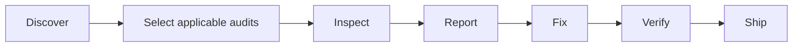

<div align="center">
  

# Fullstack Forge

**A production engineering skill suite for AI coding agents.**

One audit system. Forty-two specialist skills. Evidence before confidence.

[](https://github.com/thethunderbolt/fullstack-forge-skill/releases)
[](https://github.com/thethunderbolt/fullstack-forge-skill/actions/workflows/ci.yml)
[](LICENSE)
[](SECURITY.md)
[](package.json)
</div>

Fullstack Forge gives AI coding agents a repeatable way to audit, fix, verify, and report on real
full-stack applications. It discovers the actual stack, selects only applicable modules, gathers
reproducible evidence, separates safe fixes from risky decisions, and refuses to call missing
evidence a pass.

It works as an open-format Agent Skill collection and as a dependency-light TypeScript CLI.

```bash
npm install --save-dev github:thethunderbolt/fullstack-forge-skill#v0.1.2 && npx forge init all
```

Codex, Claude Code, Antigravity, Gemini CLI, Cursor, Windsurf, GitHub Copilot, and generic Agent
Skills are supported. [Commands](docs/COMMANDS.md) · [Platforms](docs/PLATFORM_SUPPORT.md) ·
[Contributing](CONTRIBUTING.md) · [Security](SECURITY.md) ·
[Releases](https://github.com/thethunderbolt/fullstack-forge-skill/releases)

## Why this exists

“Check best practices” is not an audit. Production readiness crosses product logic, interface
states, identity, authorization, data integrity, hostile inputs, failure recovery, deployment,
operations, and specialized features such as payments or AI tools. Fullstack Forge turns those
concerns into concrete procedures with stable findings and an honest completion contract.



## Install

### From a release archive

Download the archive for your agent from the
[latest release](https://github.com/thethunderbolt/fullstack-forge-skill/releases), verify it
against `SHA256SUMS.txt`, and extract it at the project root. Archives contain real copies, never
symlinks.

### With npm

```bash
npm install --save-dev fullstack-forge-skill
npx forge init all --dry-run
npx forge init all
```

Until the package is published to npm, install from the repository or a release tarball:

```bash
npm install --save-dev github:thethunderbolt/fullstack-forge-skill#v0.1.2
```

The installer writes `.fullstack-forge/install-manifest.json`. It will not overwrite unowned or
modified files, follows no destination symlinks, and uninstalls only unchanged files it owns.

## Quick start

Invoke the skill in your agent:

```text
$fullstack-forge audit this application before release
$forge-security audit the changed authentication flow
/forge-ui audit the running application at mobile and desktop widths
```

Or use the CLI:

```bash
forge discover audit
forge ui audit
forge ux audit
forge security audit --json
forge uploads audit
forge queries audit
forge all audit --scope changed --base origin/main
forge all audit --scope full
forge all fix --safe
forge ship --allow-run
```

Discovery creates ignored local artifacts at `.forge/project-profile.json` and
`.forge/architecture-map.md`. Audits generate `.forge/report.json` and `.forge/report.md`.

## The 42 skills

| Family        | Skills                                                                                                                                                                                                          |
| ------------- | --------------------------------------------------------------------------------------------------------------------------------------------------------------------------------------------------------------- |
| Foundation    | `forge-discover`, `forge-requirements`, `forge-architecture`, `forge-code`                                                                                                                                      |
| Experience    | `forge-ui`, `forge-ux`, `forge-accessibility`, `forge-i18n`, `forge-seo`, `forge-frontend`                                                                                                                      |
| Boundaries    | `forge-api`, `forge-jobs`, `forge-integrations`, `forge-auth`, `forge-authorization`, `forge-security`, `forge-privacy`, `forge-tenancy`, `forge-uploads`                                                       |
| Data          | `forge-database`, `forge-queries`, `forge-cache`, `forge-storage`                                                                                                                                               |
| Delivery      | `forge-testing`, `forge-performance`, `forge-scale`, `forge-observability`, `forge-reliability`, `forge-recovery`, `forge-deployment`, `forge-infrastructure`, `forge-supply-chain`, `forge-cost`, `forge-docs` |
| Specialized   | `forge-analytics`, `forge-notifications`, `forge-ai`, `forge-payments`, `forge-realtime`, `forge-offline`                                                                                                       |
| Orchestration | `forge-all`, `forge-ship`                                                                                                                                                                                       |

Every command skill is self-contained and supports `audit`, `fix`, `verify`, and `report`. Each one
defines when it applies, inputs, an executable and manual procedure, evidence rules, stable IDs,
severity, safe/risky fixes, verification, standards, stack guidance, limitations, and the same
completion contract. Together they enumerate 957 explicit inspection criteria and 212
discipline-specific inspection steps — `forge-database` reads schema, types, cascades, and migration
history, while `forge-realtime` traces connect authorization, channel isolation, reconnection, and
backpressure — so specialized risks remain visible instead of disappearing behind a generic “best
practices” instruction.

## Finding contract

Every finding includes:

```text
id · section · title · severity · confidence · status · location · evidence
impact · recommendation · safe_fix · verification · standards · analyzer_id
trace · evidence_snapshot · verification_plan
```

Statuses are `PASS`, `FAIL`, `WARNING`, `NOT_APPLICABLE`, `NOT_VERIFIED`, and `BLOCKED`. Severities
are `CRITICAL`, `HIGH`, `MEDIUM`, `LOW`, and `INFO`. A pass requires code/line evidence, a
successful check, running-app inspection, a behavior-demonstrating test, or verified configuration
output. Silence is not a pass.

```text
PASS            direct evidence satisfied the stated check
FAIL            reproducible evidence shows a defect
WARNING         risk exists without a proven defect
NOT_APPLICABLE  discovery shows the module is outside scope
NOT_VERIFIED    required behavior or environment evidence is missing
BLOCKED         approval, access, or a required tool is unavailable
```

The CLI has a typed safe-fix registry. It can replace actual-looking values in environment templates
with explicit placeholders, add `noopener noreferrer` to proven JSX `target="_blank"` links, and add
`X-Content-Type-Options: nosniff` to an existing global Vercel header rule. Every write is bound to
a confirmed finding, exact post-audit hash, structural parser, repository-contained path, and
finding-specific verification. Identity, tenant, upload policy, data, migration, secret rotation,
financial, legal, architecture, production, and destructive changes remain approval-bound.

## CLI

```text
forge <section> <audit|fix|verify|report> [options]
forge all audit --scope changed [--base <ref>]
forge init <platform|all> [--global] [--dry-run]
forge update [platform] [--dry-run]
forge uninstall [platform] [--dry-run]
forge doctor | validate | package | list
forge tool <name>
```

The CLI includes bounded TypeScript-compiler and structured-config analyzers for supported
JavaScript/TypeScript security, auth, authorization, tenancy, upload, query, cache, accessibility,
AI, payment, and integration shapes. Keyword scanners remain secondary discovery signals and never
establish a pass. Unsupported languages or frameworks are reported as `NOT_VERIFIED` with the
missing adapter named. Project commands execute only after their local definitions are shown and
`--allow-run` is supplied.

When the audited project has Playwright installed, `forge tool inspect-rendered-ui <url>` captures
desktop, tablet, and mobile screenshots plus browser console output into `.forge/evidence/ui/` as
direct running-application evidence for UI, UX, and accessibility audits. Without Playwright or a
reachable URL the tool reports `BLOCKED` and rendered-state criteria stay `NOT_VERIFIED` — visual
evidence is captured, never fabricated.

See [commands](docs/COMMANDS.md).

## Platform support

| Agent                  | Project path        | User/global path              | Typical invocation      |
| ---------------------- | ------------------- | ----------------------------- | ----------------------- |
| Codex                  | `.agents/skills/`   | `~/.agents/skills/`           | `$fullstack-forge`      |
| Claude Code            | `.claude/skills/`   | `~/.claude/skills/`           | `/fullstack-forge`      |
| Antigravity            | `.agents/skills/`   | `~/.gemini/config/skills/`    | name the skill          |
| Gemini CLI             | `.gemini/skills/`   | `~/.gemini/skills/`           | `/skills`, then name it |
| Cursor                 | `.cursor/skills/`   | `~/.cursor/skills/`           | `/fullstack-forge`      |
| Windsurf/Devin Cascade | `.windsurf/skills/` | `~/.codeium/windsurf/skills/` | `@fullstack-forge`      |
| GitHub Copilot         | `.github/skills/`   | `~/.copilot/skills/`          | name or auto-select     |
| Generic Agent Skills   | `.agents/skills/`   | `~/.agents/skills/`           | agent-specific          |

These paths were verified against current primary platform documentation on 2026-07-18. Some
platforms also scan `.agents/skills/`. See [platform support](docs/PLATFORM_SUPPORT.md) for global
paths, aliases, caveats, and primary sources.

## Canonical and generated architecture

`src/fullstack-forge/` is the canonical source. `npm run generate` renders command skills from the
ordered module catalog and synchronizes six platform roots with per-file SHA-256 ownership
manifests. Synchronization refuses modified or unowned managed paths. CI fails if a generated copy
drifts.

See [architecture](docs/ARCHITECTURE.md), [development](docs/DEVELOPMENT.md),
[release process](docs/RELEASING.md), and the
[v0.1.0 historical verification record](docs/RELEASE_VERIFICATION_v0.1.0.md). The
[v0.1.1 verification record](docs/RELEASE_VERIFICATION_v0.1.1.md) separates local, CI, publication,
asset-download, and clean-room evidence.

## Safety and limitations

Fullstack Forge is an engineering audit aid, not a compliance certificate, penetration test, legal
opinion, accessibility conformance claim, financial audit, or substitute for production access.
Static analyzers are bounded, can produce false positives, and do not imply complete coverage of an
unsupported stack. Runtime, provider, database, browser, assistive-technology, and operator checks
stay `NOT_VERIFIED` until actually performed.

Read the [security model](docs/SECURITY_MODEL.md) and report vulnerabilities through
[SECURITY.md](SECURITY.md).

## Research and attribution

The implementation adapts concepts—not third-party code or substantial prose—from public standards,
official platform documentation, and open-source skill repositories. Exact revisions, access dates,
licenses, and handling decisions are in [research sources](research/SOURCES.md), the
[license matrix](research/LICENSE_MATRIX.md), and [third-party notices](THIRD_PARTY_NOTICES.md).

## Contributing and license

See [CONTRIBUTING.md](CONTRIBUTING.md) and [CODE_OF_CONDUCT.md](CODE_OF_CONDUCT.md). Fullstack Forge
is licensed under [Apache-2.0](LICENSE).
