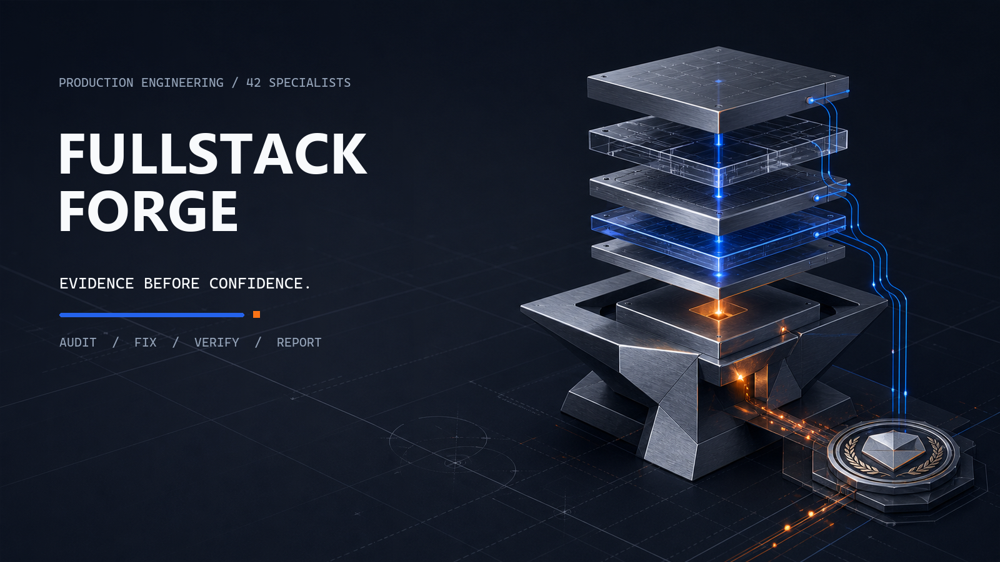

# Turn your AI coding agent into a production-focused full-stack engineer

Fullstack Forge is an Agent Skill that guides AI coding agents through architecture, security,
databases, APIs, frontend, UI, UX, testing, performance, reliability, and release readiness.

Once installed, it works automatically. Continue talking to your AI agent normally. Forge is
agent-guided, with deterministic CLI checks and evidence gates where supported.

[](https://github.com/is-bo/fullstack-forge-skill/releases)
[](https://github.com/is-bo/fullstack-forge-skill/actions/workflows/ci.yml)



## Install

Requires Node.js 24 or newer.

```bash
npm install --save-dev "git+https://github.com/is-bo/fullstack-forge-skill.git#v0.1.0"
npx forge init
npx forge doctor
```

Restart or reopen your AI coding agent only if it does not refresh installed project skills
automatically. `forge init` installs skills and ownership-managed project instructions for detected
hosts; use `forge init all` only when you intentionally want every bundled platform.

## How to use it

Tell your AI agent what you want:

> Add appointment cancellation and notify the patient.

> Review the database queries and optimise anything that is actually inefficient.

> Improve the mobile booking experience.

> Prepare this application for release.

Forge activates automatically and loads only the relevant modules. No Forge command is required.

## Optional commands

Use an explicit Forge command when you want to force or narrow a workflow:

```text
$forge audit security
$forge audit queries
$forge audit cache
$forge frontend
$forge ui review
$forge ux review
$forge verify
$forge ship
```

The installed skill name is `forge`; host syntax differs:

```text
Agent Skills form where supported:  $forge audit cache
Slash form where the host exposes skills as commands:  /forge audit cache
Terminal and CI:  npx forge audit cache
```

The terminal form is the stable executable interface. See
[platform support](docs/PLATFORM_SUPPORT.md) for host-specific selection forms and live-UI
limitations. Explicit commands preserve the same evidence and approval rules as automatic use.

## What Forge does

For a normal feature, Forge helps the agent:

- understand the existing application;
- select relevant engineering modules;
- implement through existing patterns;
- check related production concerns;
- run focused tests and tools;
- report what was verified and what remains uncertain.

Forty-two specialist modules cover foundation, frontend experience, APIs and trust boundaries, data,
delivery, and capabilities such as notifications, AI, payments, realtime, and offline behavior.
Natural-language routing is an initial aid: direct repository evidence determines final
applicability.

## Short example

```text
User:
Add a feature that lets doctors cancel appointments and notify patients.

Agent with Fullstack Forge:
- Inspects the appointment and notification architecture.
- Selects API, database, authorization, notification, UX, and testing guidance.
- Implements status transitions and prevents unauthorized cancellation.
- Handles notification failure and adds focused tests.
- Reports the checks that passed and any proof that remains unavailable.
```

For a one-line visual adjustment, Forge keeps the plan and validation focused. For identity,
permissions, personal data, payments, uploads, destructive operations, secrets, or tenancy, it
requires stronger evidence and surfaces approval boundaries.

## Supported agents

| Host                                             | Installed project skill path | Managed automatic instruction                          |
| ------------------------------------------------ | ---------------------------- | ------------------------------------------------------ |
| Codex, generic Agent Skills, Antigravity project | `.agents/skills/`            | `AGENTS.md`                                            |
| Claude Code                                      | `.claude/skills/`            | `CLAUDE.md`                                            |
| Gemini CLI                                       | `.gemini/skills/`            | `GEMINI.md`                                            |
| Cursor                                           | `.cursor/skills/`            | `.cursor/rules/fullstack-forge.mdc`                    |
| Windsurf                                         | `.windsurf/skills/`          | `.windsurf/rules/fullstack-forge.md`                   |
| GitHub Copilot                                   | `.github/skills/`            | `.github/instructions/fullstack-forge.instructions.md` |

Installation is manifest-owned, path-contained, and symlink-free. Updates preserve modified and
user-authored instructions; uninstall removes only unchanged Forge-owned content. See
[getting started](docs/GETTING_STARTED.md) and [platform support](docs/PLATFORM_SUPPORT.md).

## Evidence and limitations

Forge is not a standalone universal scanner and does not guarantee that an application is
production-ready. It gives the AI agent a structured, evidence-based production-readiness workflow.

A `PASS` requires affirmative evidence. Applicable proof that cannot be obtained stays
`NOT_VERIFIED` or `BLOCKED`; a concern shown to be outside the affected boundary is reasoned
`NOT_APPLICABLE`, never a synthetic pass. Agent-authored findings bind source or runtime evidence,
revision, commands, limitations, and verification. Build state and historical reports never satisfy
the independent Ship gate.

Detailed references:

- [Architecture](docs/ARCHITECTURE.md)
- [Commands](docs/COMMANDS.md) and [CLI reference](docs/CLI_REFERENCE.md)
- [Finding schema](docs/FINDING_SCHEMA.md) and [report schema](docs/REPORT_SCHEMA.md)
- [Build mode](docs/BUILD_MODE.md) and [release workflow](docs/RELEASE.md)

## Development and contributor information

Canonical skill sources live in `src/fullstack-forge/`. Generated platform copies must not be edited
by hand.

```bash
npm ci --ignore-scripts --no-audit --no-fund
npm run generate
npm run check
```

See [development](docs/DEVELOPMENT.md), [contributing](CONTRIBUTING.md), and
[security](SECURITY.md).

## Version policy

`v0.1.0` is the first intentionally supported public release of the agent-first Fullstack Forge
product. Earlier numbered snapshots were development previews preserved in Git history.

## License

Apache-2.0. See [LICENSE](LICENSE), [NOTICE](NOTICE), and
[THIRD_PARTY_NOTICES.md](THIRD_PARTY_NOTICES.md).
