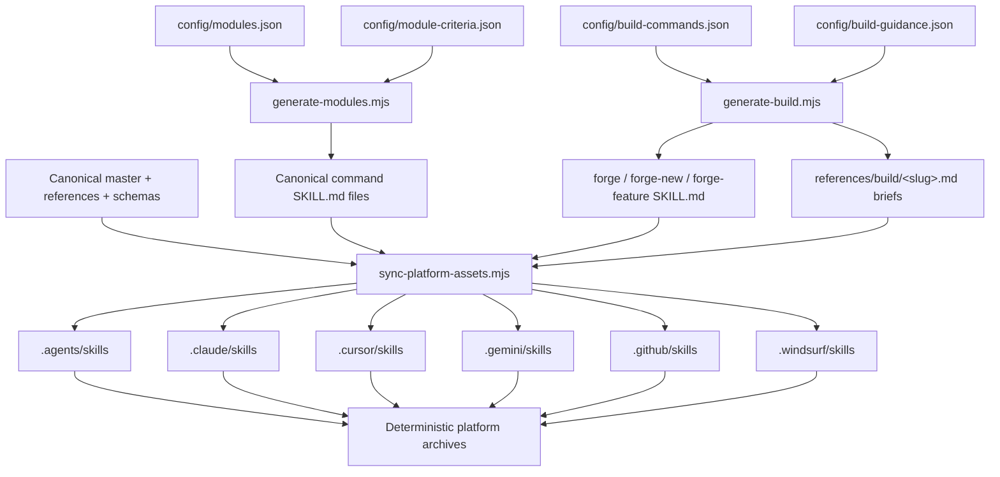
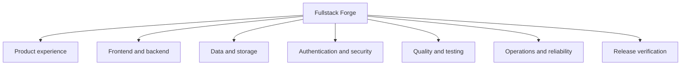

# Architecture

## Source of truth

`config/modules.json` is the ordered semantic catalog for 42 command modules, and
`config/module-criteria.json` is the matching explicit inspection-criteria catalog.
`config/build-guidance.json` is the matching hand-authored per-module build-discipline brief catalog
(decide-before-coding prompts plus evidence-to-produce), and `config/build-commands.json` holds the
metadata for the simple router plus two expert Build command skills. `src/fullstack-forge/` is the
canonical Agent Skill. The generator renders `src/fullstack-forge/commands/forge-*/SKILL.md` and
`src/fullstack-forge/references/build/<slug>.md`, then copies the master and command skills into
each verified platform root.

Generated roots carry `.fullstack-forge-generated.json`, which records every owned file and SHA-256
hash. Synchronization may update an unchanged owned file, but refuses an unowned collision or a
manual edit. Consumer installation uses a separate `.fullstack-forge/install-manifest.json` with the
same principle.

`generate-build.mjs` is a separate generator from `generate-modules.mjs`'s audit-module contract; it
is wired into `npm run generate` alongside it. It validates `config/build-commands.json` against the
authoritative `expectedBuildCommands` set (`forge`, `forge-new`, `forge-feature`) and
`config/build-guidance.json` against `expectedSlugs` (every brief slug must be a real audit-module
slug; no unknown slug is accepted), then renders each command skill and each ≤60-line discipline
brief. A dedicated test enforces exact slug-set equality between the guidance map and the 42 audit
modules, so audit modules and build briefs cannot silently drift apart.

## CLI layers

- `constants.ts` contains closed module, tool, and platform allowlists.
- `simple-cli.ts` parses the simple vocabulary, natural-language areas and feature IDs, menu model,
  typo recovery, compact reports, install results, doctor output, and status without duplicating an
  audit or Build engine.
- `discovery.ts` produces the structured profile-v2 application and capability model.
- `analyzers.ts` provides bounded compiler-API and structured-configuration analyzers.
- `inspectors.ts` routes typed analyzers and retains text inventory as secondary discovery signals.
- `scope.ts` resolves Git merge-base and working-tree change impact with inclusion reasons.
- `fixes.ts` applies hash-bound, structurally validated entries from a typed safe-fix registry.
- `verification.ts` executes finding-specific analyzer, command, structural, or manual plans.
- `gates.ts` evaluates the explicit internal, project-native, audit, and capability gate registry.
- `evidence-envelope.ts` is the shared typed integrity primitive for Audit, Ship, and Build
  evidence: registered producer contracts, canonical-root/revision identity, expiry, exact claims,
  and one-to-one path/hash/media-type artifacts. Build and Ship use separate producer registries and
  domains, so Build evidence is structurally ineligible for Ship.
- `finding.ts` enforces the shared finding contract.
- `report.ts` deduplicates, ranks, and renders JSON/Markdown evidence.
- `installer.ts` performs path-contained, symlink-refusing, manifest-owned copies and removals.
- `tools.ts` exposes the executable tool catalog.
- `build.ts` implements `new`, `feature`, `resume`, and explicit `migrate build` dispatch: argument
  parsing, phase transitions, current planning, producer execution, runtime adaptation,
  repair-counter advancement, and the `done` missing-items computation.
- `build-applicability.ts` derives `REQUIRED`, `SUGGESTED`, `EXCLUDED`, and `UNRESOLVED` discipline
  decisions from classified discovery and implementation evidence; weak/non-production paths never
  activate a requirement.
- `build-gates.ts` is the pure, Build-only tier gate registry. It maps current applicability,
  detected commands, capabilities, and runtime availability to exact required criteria and waiver
  policies; it neither executes commands nor shares Ship state.
- `build-producers.ts` is the exact `(script, criterion)` command-producer registry plus a closed
  internal-producer registry. It owns allow-run/offline execution contracts and never converts an
  unavailable producer into `PASS`.
- `build-runtime.ts` plans the finite eight-state by three-viewport matrix and adapts rendered-UI,
  keyboard, accessibility, overflow, and design-direction observations into Build criteria.
- `build-migration.ts` performs explicit, journaled schema-v1 to schema-v2 migration with complete
  pre-validation, hash-bound byte backups, atomic writes, resume, and rollback.
- `build-migration-journal.ts` owns the exact journal, entry, hash, backup-mapping, and lifecycle
  validator shared by migration commands and ordinary Build loads, so a malformed terminal status
  cannot bypass the interrupted-migration guard.
- `build-state.ts` defines the `.forge/build/project.json` and `.forge/build/features/<slug>.json`
  shapes, validates them fail-closed on every load (mirroring `readReport`), sanitizes
  agent-authored free text through the redaction layer before persisting, and re-verifies positive
  producer envelopes on load, demoting anything stale, malformed, cross-root, cross-revision,
  expired, or artifact-mismatched to `NOT_VERIFIED`.
- `src/fullstack-forge/schemas/build-project.schema.json` and `build-feature.schema.json` are the
  published schemas for the same two state shapes.
- `cli.ts` parses commands, selects modules, gates subprocesses, orchestrates reports, and
  dispatches build verbs (`new`, `feature`, `resume`) to `build.ts` before any module-slug parsing.

The runtime uses Node.js built-ins plus the bundled TypeScript compiler API for supported AST
analysis. Development dependencies provide formatting and linting; release consumers receive the
compiled CLI and its pinned runtime dependency.

## Build and Ship evidence flow

```mermaid
flowchart LR
  D["Current discovery + changed scope"] --> A["Build applicability"]
  A --> G["Build tier gate plan"]
  G --> P["Exact registered producers"]
  P --> E["Build evidence envelopes"]
  E --> C["Re-verify + re-derive at done"]
  C --> B["Build done"]
  B -. "no evidence authority" .-> S["Ship stable-revision rediscovery"]
  S --> I["Current Ship inspectors and commands"]
  I --> H["Ship evidence envelopes"]
  H --> R["Release gate"]
```

The dashed edge is workflow continuity, not trust delegation. Persisted Build state and prior Audit
reports remain useful diagnostics, but neither supplies a Ship outcome. Ship re-discovers,
re-inspects, and re-hashes current artifacts within a stable working-tree revision; command evidence
also binds the detected definition source and post-run input bytes.

## Trust boundaries

Repository content, manifests, scripts, reports, Build state, migration journals, evidence
envelopes, installed ownership manifests, and fetched research are untrusted input. The CLI treats
platform, tool, producer, criterion, and gate names as closed contracts, constrains paths to a
canonical root, refuses destination symlinks, executes no shell string, and requires `--allow-run`
before a detected project script. See `docs/SECURITY_MODEL.md`.

## Evidence boundary

Bounded analyzers can prove supported source-to-sink and structured-configuration defects. Keyword
inventory remains a discovery signal. Typed envelopes prove local identity, integrity, freshness,
and contract matching; they are not external attestations and do not strengthen what a producer
actually observed. Neither static analysis nor a local envelope establishes runtime correctness,
policy intent, production configuration, provider settings, or compliance. Unsupported languages,
framework shapes, producers, and external tools remain `NOT_VERIFIED` or `BLOCKED` rather than
receiving an optimistic pass.
