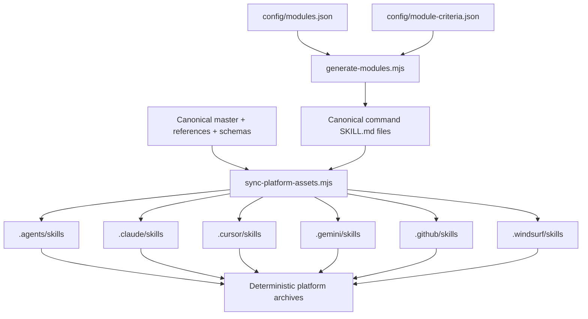
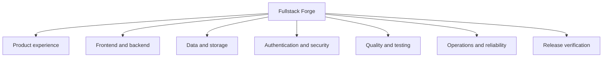

# Architecture

## Source of truth

`config/modules.json` is the ordered semantic catalog for 42 command modules, and
`config/module-criteria.json` is the matching explicit inspection-criteria catalog.
`src/fullstack-forge/` is the canonical Agent Skill. The generator renders
`src/fullstack-forge/commands/forge-*/SKILL.md`, then copies the master and command skills into each
verified platform root.

Generated roots carry `.fullstack-forge-generated.json`, which records every owned file and SHA-256
hash. Synchronization may update an unchanged owned file, but refuses an unowned collision or a
manual edit. Consumer installation uses a separate `.fullstack-forge/install-manifest.json` with the
same principle.

## CLI layers

- `constants.ts` contains closed module, tool, and platform allowlists.
- `discovery.ts` produces the structured profile-v2 application and capability model.
- `analyzers.ts` provides bounded compiler-API and structured-configuration analyzers.
- `inspectors.ts` routes typed analyzers and retains text inventory as secondary discovery signals.
- `scope.ts` resolves Git merge-base and working-tree change impact with inclusion reasons.
- `fixes.ts` applies hash-bound, structurally validated entries from a typed safe-fix registry.
- `verification.ts` executes finding-specific analyzer, command, structural, or manual plans.
- `gates.ts` evaluates the explicit internal, project-native, audit, and capability gate registry.
- `finding.ts` enforces the shared finding contract.
- `report.ts` deduplicates, ranks, and renders JSON/Markdown evidence.
- `installer.ts` performs path-contained, symlink-refusing, manifest-owned copies and removals.
- `tools.ts` exposes the executable tool catalog.
- `cli.ts` parses commands, selects modules, gates subprocesses, and orchestrates reports.

The runtime uses Node.js built-ins plus the bundled TypeScript compiler API for supported AST
analysis. Development dependencies provide formatting and linting; release consumers receive the
compiled CLI and its pinned runtime dependency.

## Trust boundaries

Repository content, manifests, scripts, reports, installed ownership manifests, and fetched research
are untrusted input. The CLI treats platform and tool names as enums, constrains paths to a
canonical root, refuses destination symlinks, executes no shell string, and requires `--allow-run`
before a detected project script. See `docs/SECURITY_MODEL.md`.

## Evidence boundary

Bounded analyzers can prove supported source-to-sink and structured-configuration defects. Keyword
inventory remains a discovery signal. Neither can establish runtime correctness, policy intent,
production configuration, provider settings, or compliance. Unsupported languages and framework
shapes, and every applied module without sufficient direct evidence, remain `NOT_VERIFIED` rather
than receiving an optimistic pass.
