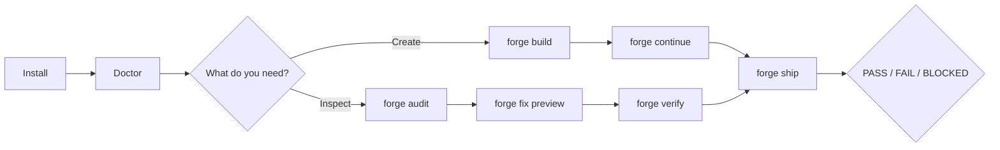

# Fullstack Forge v0.4 product-layer design

## Decision

Add one simple, progressive product layer without changing the trusted Build, Audit, Fix, Verify,
Report, or Ship engines. The CLI and generated `forge` Agent Skill share the same public vocabulary.
Expert commands, report schemas, finding IDs, Build state, and approval/evidence rules remain
stable.

## User journey

The default terminal layer answers: what ran, what was found, why it matters, whether a bounded safe
fix exists, and what to do next. Complete Markdown and JSON evidence is retained separately.

## Command mapping

| Simple command          | Trusted internal mapping                                     | Safety behavior                                                                 |
| ----------------------- | ------------------------------------------------------------ | ------------------------------------------------------------------------------- |
| `forge build`           | `forge new` when project state is absent; otherwise continue | Project questions stay agent-guided; framing is not proof.                      |
| `forge build <request>` | safe slug + `forge feature <slug> --summary <request>`       | Redacts input, rejects reserved IDs, and adds a deterministic collision suffix. |
| `forge continue`        | feature-state lookup + `forge feature <slug>`                | Continues only one unfinished item; asks or refuses on ambiguity.               |
| `forge audit`           | `forge all audit --scope changed \| full`                    | Changed scope requires a reliable Git base; full is explicit fallback.          |
| `forge audit all`       | `forge all audit --scope full`                               | Applicable modules still record not-applicable and missing evidence honestly.   |
| `forge audit <area>`    | natural-language map + `forge <module> audit`                | Several plausible modules produce an error and choices, not a guess.            |
| `forge fix [area]`      | `forge <module \| all> fix`                                  | Preview by default; only `--safe` executes registered bounded fixes.            |
| `forge verify [area]`   | `forge <module \| all> verify`                               | Preserves original findings and rechecks current evidence.                      |
| `forge ship`            | existing independent Ship gate                               | Build state and saved reports cannot satisfy a gate.                            |
| `forge status`          | read install manifest, Build state, and latest report        | Read-only; does not imply a release decision.                                   |
| `forge help`            | simple reference                                             | `forge help advanced` retains the full grammar.                                 |
| `forge`                 | TTY menu or noninteractive list                              | Keyboard-only, cancellable, and never required for scripts.                     |

## Output model

- Default simple output: status counts, up to five priority items, plain impact, safe-fix
  availability, evidence paths, and one next command.
- `--details`: complete Markdown technical report on stdout.
- `--json`: existing stable structured results for automation.
- `--no-color`: accepted; output is intentionally color-free by default.
- Exit `0`: requested local behavior completed with no proven failure or blocking evidence.
- Exit `1`: a confirmed failure or broken installation.
- Exit `2`: blocked, incomplete, preview-only, or not-verified outcome according to the command.

## Installation model

The first-party npm/Git package plus `forge init` is authoritative for the CLI, versioned bundled
assets, manifest ownership, link refusal, update, doctor, and uninstall. The third-party `skills`
CLI is an additional skills-only convenience and is documented with a pinned tested version and
`--copy`; its own ownership/update semantics are not represented as Forge's manifest model.

## Security decisions

- Simple parsing never invokes a shell and cannot add execution authority.
- Feature summaries pass through shared secret redaction before persistence or slug derivation.
- Area aliases are closed; unknown and ambiguous language fails closed.
- The simple layer calls existing path-contained, revision-bound, hash-bound engines.
- Interactive input chooses only a closed menu entry or a feature summary; cancellation writes
  nothing.
- Concise output never upgrades a status or hides the detailed evidence files.
